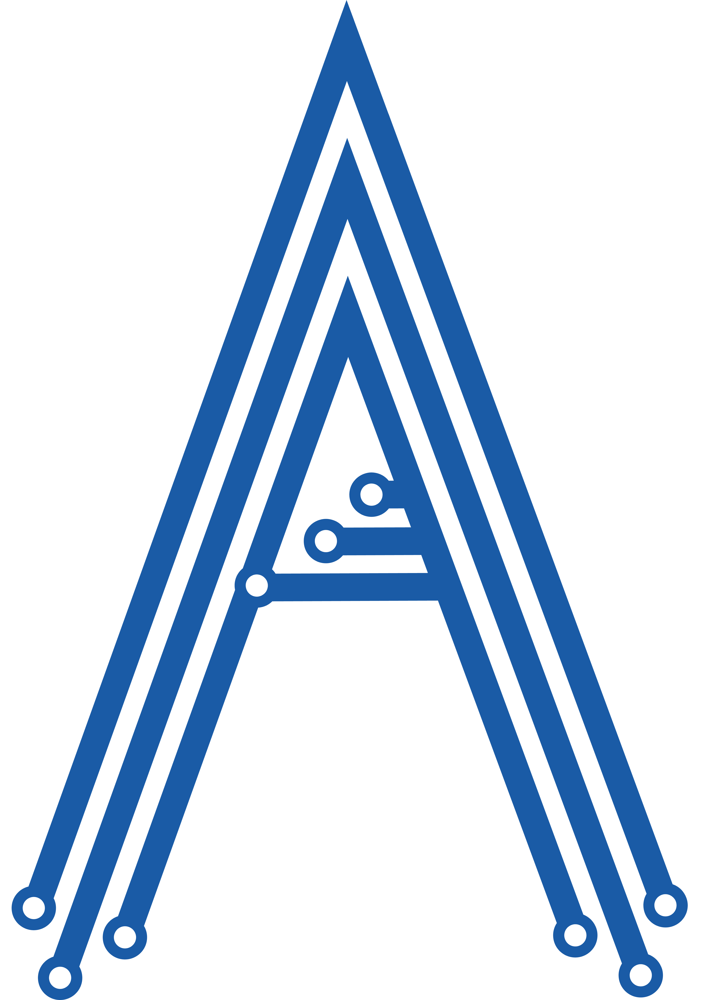

# Repository Changelog — aashenaifi.github.io — Full Diff History

All commits by Abdullah AlShenaifi. Includes every line changed per commit. PDF files excluded (binary).

---

## Commit #1 — 2024-08-22
**Hash:** `4d85496`
**Message:** Add files via upload

### Changes
```diff
diff --git a/CNAME b/CNAME
new file mode 100644
index 0000000..82fdc08
--- /dev/null
+++ b/CNAME
@@ -0,0 +1 @@
+aashenaifi.com
\ No newline at end of file
diff --git a/index.html b/index.html
new file mode 100644
index 0000000..3a8252c
--- /dev/null
+++ b/index.html
@@ -0,0 +1,128 @@
+<!DOCTYPE html>
+<html lang="en">
+<head>
+  <meta charset="UTF-8">
+  <meta name="viewport" content="width=device-width, initial-scale=1.0">
+  <title>Abdullah Alshenaifi</title>
+  <link rel="stylesheet" href="styles.css">
+
+  <link rel="stylesheet" href="styles.css">
+  
+  <link rel="preconnect" href="https://fonts.googleapis.com">
+<link rel="preconnect" href="https://fonts.gstatic.com" crossorigin>
+<link href="https://fonts.googleapis.com/css2?family=Cairo:wght@200..1000&display=swap" rel="stylesheet">
+  
+  <link rel="icon" href="images/Myfavicon.ico" type="image/x-icon">
+</head>
+
+ <body>
+    <header>
+        
+      <div class="logo">
+        
+      </div>
+
+      <div class="title">
+        <h1 data-lang="name">Abdullah Alshenaifi</h1>
+        <h2 data-lang="desc">Electronics Engineer</h2>
+      </div>
+    </header>
+
+    <section id="about">
+        <h2 data-lang="about">About me</h2>
+        <p data-lang="aboutCont">
+          I am an electronics engineer with a passion for creating innovative solutions. I have experience in designing and implementing various electronic systems, and I am always eager to learn new technologies.
+        </p>
+      </section>
+
+  <section id="projects">
+    <h2 data-lang="project">Projects</h2>
+    <ul>
+      <li>
+
+
+        <div class="project-link">
+          <a href="https://linktr.ee/smartflows" target="_blank" data-lang="projectgrad">Graduation Project</a>
+        </div>
+
+        <p data-lang="projectgradCont">A water monitoring system for shared apartments and houses, using IoT, 3D printing, and data analysis.</p>
+      </li>
+      <li>
+        <h3 data-lang="projectpeople">People with Disabilities' Room Project</h3>
+        <p data-lang="projectpeopleCont">A smart room controlled by a smartphone using the Internet of Things, designed to help people with disabilities.</p>
+      </li>
+    </ul>
+  </section>
+
+  <section id="skills">
+    <h2 data-lang="skills">Skills</h2>
+    <ul>
+      <li data-lang="skillsard">Arduino IDE</li>
+      <li data-lang="skillsprut">Proteus</li>
+      <li data-lang="skillsmicr">MicroC</li>
+      <li data-lang="skillsoffi">Microsoft Office</li>
+      <li data-lang="skillsCpp">C++</li>
+      <li data-lang="skillspyth">Python</li>
+    </ul>
+  </section>
+
+
+
+
+  <section id="CV">
+    <h2 data-lang="CV">My CV</h2>
+    <div class="pdf-container">
+      <iframe id="pdfEmbed" src="https://drive.google.com/file/d/1qhGHb62FnnTcnIxQbC5rWsPEIIkLRGo5/preview#zoom=100" type="application/pdf" width="100%" height="600px"></iframe>
+      <div class="CV-link">
+        <a id="downloadLink" href="Abdullah Alshenaifi Electronics Engineer En.pdf" data-lang="CVDownload">Click here to download the CV</a>
+      </div>
+    </div>
+  </section>
+
+
+
+
+  <section id="contact">
+    <h2 data-lang="sontact">Contact</h2>
+
+
+
+    <p data-lang="contactemailCont"> Email: abdullah@aashenaifi.com </p>
+    <p data-lang="contactphoneCont">Phone: 0554337765</p>
+
+
+    <div class="addme-link">
+      <a href="https://www.vcard.link/card/DqTX.vcf" target="_blank" data-lang="addmetocontact">Graduation Project</a>
+    </div>
+
+  
+    <div class="social-icons">
+      <a href="mailto:abdullah@aashenaifi.com"> </a>
+      <a href="https://x.com/aashenaifi"> </a>
+      <a href="https://instagram.com/AAShenaifi"> </a>
+      <a href="https://www.linkedin.com/in/AAShenaifi"> </a>
+      <a href="https://www.snapchat.com/add/aashenaifi"> </a>
+      <a href="https://www.youtube.com/@AAShenaifi"> </a>
+      <a href="https://github.com/AAShenaifi"> </a>
+
+       <div class="Vcount">
+<a data-lang="Visit"> Visitor Counter</a> 
+
+<script src="https://static.elfsight.com/platform/platform.js" data-use-service-core defer></script>
+<div class="elfsight-app-d0111968-35a4-47ef-941c-488122e132b0" data-elfsight-app-lazy></div>
+ </div>
+      
+    </div>
+  </section>
+
+
+
+
+  <select id="language-selector">
+    <option value="en">English</option>
+    <option value="ar">العربية</option>
+  </select>
+
+  <script src="script.js"></script>
+</body>
+</html>
diff --git a/script.js b/script.js
new file mode 100644
index 0000000..de68af8
--- /dev/null
+++ b/script.js
@@ -0,0 +1,103 @@
+let lang = {
+    ar: {
+      name: "عبدالله الشنيفي",
+      desc: "مهندس إلكترونيات",
+      about: "عني",
+      aboutCont: "مهندس إلكترونيات مع خبرة في مجال أنترنت الأشياء والطباعة ثلاثية الأبعاد. عضو في مجموعة أنترنت الأشياء. مهتم بالتقنيات الناشئة ومستعد لاستخدام مهاراتي ومعرفتي للمساهمة في تطوير بيئة العمل.",
+      project: "المشاريع",
+      projectgrad: "مشروع التخرج",
+      projectgradCont: "نظام مراقبة المياه للشقق والمنازل المشتركة, باستخدام أنترنت الاشياء, الطباعة ثلاثية الأبعاد, وتحليل البيانات ",
+      projectpeople: "مشروع غرفة الأشخاص ذوي الإعاقة ",
+      projectpeopleCont: "غرفة ذكية بالتحكم عن طريق الجوال باستخدام انترنت الأشياء",
+      
+
+      langs: "اللغات",
+      langsCont: "العربية , الأنجليزية",
+
+      skills: "المهارات",
+      skillsard: "Arduino IDE",
+      skillsprut: "Proteus",
+      skillsmicr: "MicroC",
+      skillsoffi: "برامج الأوفيس",
+      skillsCpp: "C++",
+      skillspyth: "Python",
+
+      CV: "سيرتي الذاتية",
+      CVDownload: "لتحميل ملف السيرة الذاتية",
+
+      contact: "للتواصل",
+      contactemailCont: 'البريد الإلكتروني:abdullah@aashenaifi.com', 
+      
+    contactphoneCont: "رقم الجوال: 0554337765",
+    addmetocontact: "أضفني إلى جهات اتصالك",
+    Visit: "عدد الزوار",
+
+
+    Rights: "جميع الحقوق محفوظة لعبدالله الشنيفي © 2024",
+    },
+  
+    en: {
+      name: "Abdullah Alshenaifi",
+      desc: "Electronics Engineer",
+      about: "About me",
+      aboutCont: "An electronics engineer with experience in the field of IOT and 3D printing. A member of the IOT for Arab group. Interested in emerging technologies and ready to use my skills and knowledge to contribute to the development of the work environment.",
+      project: "Projects",
+      projectgrad: "Graduation Project",
+      projectgradCont: "A water monitoring system for shared apartments and houses, using IoT, 3D printing, and data analysis.",
+      projectpeople: "People with Disabilities' Room Project",
+      projectpeopleCont: "A smart room controlled by a smartphone using the Internet of Things, designed to help people with disabilities.",
+      
+      //add later 
+      langs: "Languages",
+      langsCont: "Arabic , english",
+
+      skills: "Skills",
+      skillsard: "Arduino IDE",
+      skillsprut: "Proteus",
+      skillsmicr: "MicroC",
+      skillsoffi: "Microsoft Office",
+      skillsCpp: "C++",
+      skillspyth: "Python",
+
+      CV: "My CV",
+      CVDownload: "to download the CV",
+
+      contact: "Contact",
+      contactemailCont: 'Email:abdullah@aashenaifi.com',  
+      contactphoneCont: "Phone: 0554337765",
+      
+      addmetocontact: "Add me to your Contacts",
+      Visit: "Visitor Counter",
+
+
+      Rights: "2024 Abdullah Alshenaifi. All rights reserved.",
+    },
+  };
+  
+  let selector = document.getElementById('language-selector');
+selector.addEventListener('change', updateLanguage);
+
+function updateLanguage() {
+  let language = selector.value;
+  let nodes = document.querySelectorAll('[data-lang]');
+
+  nodes.forEach(node => {
+    let key = node.getAttribute('data-lang');
+    node.textContent = lang[language][key];
+  });
+
+  let pdfEmbed = document.getElementById("pdfEmbed");
+  let downloadLink = document.getElementById("downloadLink");
+  if (language === "ar") {
+    pdfEmbed.src = "https://drive.google.com/file/d/16Vvo1pywdQGr30anaZKNyo-XwunGXnWg/preview#zoom=100";
+    downloadLink.href = "Abdullah Alshenaifi Electronics Engineer Ar.pdf";
+    document.dir = "rtl";
+  } else {
+    pdfEmbed.src = "https://drive.google.com/file/d/1qhGHb62FnnTcnIxQbC5rWsPEIIkLRGo5/preview#zoom=100";
+    downloadLink.href = "Abdullah Alshenaifi Electronics Engineer En.pdf";
+    document.dir = "ltr";
+  }
+}
+
+
+updateLanguage(); 
diff --git a/styles.css b/styles.css
new file mode 100644
index 0000000..db6bd7d
--- /dev/null
+++ b/styles.css
@@ -0,0 +1,126 @@
+
+@import url('https://fonts.googleapis.com/css2?family=Cairo:wght@200..1000&display=swap');
+
+  
+  body {
+    font-family: 'Cairo', Arial, sans-serif;
+
+  }
+
+
+
+
+header {
+    background-color: #696969;
+    color: #fff;
+    padding: 10px;
+    display: flex;
+    align-items: center; 
+  }
+  
+  header img {
+    max-width: 80px; 
+    height: auto;
+    margin-right: 20px; 
+    margin-left: 20px; 
+
+  }
+
+.title {
+  white-space: nowrap;
+}
+
+
+  header h1 {
+  font-family: "Cairo", sans-serif;
+  font-optical-sizing: auto;
+  font-weight: 900;
+  font-style: normal;
+    margin: 0;
+  }
+  header h2 {
+    font-family: "Cairo", sans-serif;
+    font-optical-sizing: auto;
+    font-weight: 750;
+    font-style: normal;
+      margin: 0;
+    }
+
+#contact {
+  padding: 10px;
+  margin-top: 10; 
+  background-color: #f0f0f0; 
+}
+
+#contact h2 {
+  color: #333;
+}
+
+#contact p {
+  color: #666;
+}
+
+
+.social-icons {
+  margin-top: 10px; 
+}
+
+.social-icons a {
+  color: #333;
+  font-size: 20px;
+  margin-right: 10px; 
+}
+
+  
+  @media (max-width: 600px) {
+    header h1 {
+      font-size: 24px;
+    }
+  
+    header img {
+      max-width: 80px; 
+    }
+  
+    section {
+      padding: 10px;
+    }
+  
+    footer {
+      padding: 5px;
+    }
+  }
+
+
+
+  #language-selector {
+    position: fixed;
+    top: 10px;
+    right: 10px;
+  }
+  
+  .project-link a {
+    font-size: 1.2rem; 
+    text-decoration: underline; 
+    color: #000;
+  }
+
+  .Vcount a {
+    margin-right: 10px; 
+
+    font-size: 1rem; 
+    text-decoration: none;
+    color: #000; 
+  }
+
+
+  .addme-link a {
+    font-size: 1rem; 
+    text-decoration: underline;
+    color: #000; 
+  }
+
+  .CV-link a {
+    font-size: 1rem; 
+    text-decoration: underline; 
+    color: #000;
+  }
```

---

## Commit #2 — 2024-08-22
**Hash:** `645bbfc`
**Message:** Delete Abdullah Alshenaifi Electronics Engineer En.pdf

*(PDF only — no code diff)*

---

## Commit #3 — 2024-08-22
**Hash:** `fb156b5`
**Message:** Rename Abdullah Alshenaifi Electronics Engineer En.pdf.pdf to Abdullah Alshenaifi Electronics Engineer En.pdf

*(PDF only — no code diff)*

---

## Commit #4 — 2024-09-03
**Hash:** `c09ab70`
**Message:** Update index.html

### Changes
```diff
diff --git a/index.html b/index.html
index 3a8252c..d88c511 100644
--- a/index.html
+++ b/index.html
@@ -72,7 +72,7 @@
   <section id="CV">
     <h2 data-lang="CV">My CV</h2>
     <div class="pdf-container">
-      <iframe id="pdfEmbed" src="https://drive.google.com/file/d/1qhGHb62FnnTcnIxQbC5rWsPEIIkLRGo5/preview#zoom=100" type="application/pdf" width="100%" height="600px"></iframe>
+      <iframe id="pdfEmbed" src="https://drive.google.com/file/d/12TKgFhOvbwiTSVavMNrXdPYs5umi1jTv/preview#zoom=100" type="application/pdf" width="100%" height="600px"></iframe>
       <div class="CV-link">
         <a id="downloadLink" href="Abdullah Alshenaifi Electronics Engineer En.pdf" data-lang="CVDownload">Click here to download the CV</a>
       </div>
```

---

## Commit #5 — 2024-09-03
**Hash:** `6ec8f36`
**Message:** Update script.js

### Changes
```diff
diff --git a/script.js b/script.js
index de68af8..2aef8b9 100644
--- a/script.js
+++ b/script.js
@@ -93,7 +93,7 @@ function updateLanguage() {
     downloadLink.href = "Abdullah Alshenaifi Electronics Engineer Ar.pdf";
     document.dir = "rtl";
   } else {
-    pdfEmbed.src = "https://drive.google.com/file/d/1qhGHb62FnnTcnIxQbC5rWsPEIIkLRGo5/preview#zoom=100";
+    pdfEmbed.src = "https://drive.google.com/file/d/12TKgFhOvbwiTSVavMNrXdPYs5umi1jTv/preview#zoom=100";
     downloadLink.href = "Abdullah Alshenaifi Electronics Engineer En.pdf";
     document.dir = "ltr";
   }
```

---

## Commit #6 — 2024-09-09
**Hash:** `03380c1`
**Message:** Delete Abdullah Alshenaifi Electronics Engineer En.pdf

*(PDF only — no code diff)*

---

## Commit #7 — 2024-09-10
**Hash:** `ff6ecec`
**Message:** Add files via upload

*(PDF only — no code diff)*

---

## Commit #8 — 2024-09-10
**Hash:** `c0c174b`
**Message:** Update index.html

### Changes
```diff
diff --git a/index.html b/index.html
index d88c511..7fb8c7b 100644
--- a/index.html
+++ b/index.html
@@ -31,10 +31,20 @@
     <section id="about">
         <h2 data-lang="about">About me</h2>
         <p data-lang="aboutCont">
-          I am an electronics engineer with a passion for creating innovative solutions. I have experience in designing and implementing various electronic systems, and I am always eager to learn new technologies.
+          An ambitious electronics engineer with previous experience in Internet of Things (IOT) and 3D printing. Co-owner of Alamat Robotics, where I engineered electronics for various robotics projects. Passionate about emerging technologies, and ready to leverage my skills and knowledge to drive innovation and enhance the work environment. Accredited as an Engineer by the Saudi Council of Engineers (SEC)
         </p>
       </section>
 
+   <section id="Exp">
+    <h2 data-lang="Exp">Experience</h2>
+    <ul>
+      <li>
+
+        <div class="alamat-link">
+          <a href="https://linktr.ee/alamat.robotics" target="_blank" data-lang="alamat">Alamat Robotics</a>
+          <h4 data-lang="Co">Co-Owner</h4>
+        </div>
+
   <section id="projects">
     <h2 data-lang="project">Projects</h2>
     <ul>
@@ -57,12 +67,15 @@
   <section id="skills">
     <h2 data-lang="skills">Skills</h2>
     <ul>
-      <li data-lang="skillsard">Arduino IDE</li>
+      <li data-lang="skillspyth">Soldering SMT and THT</li>
+      <li data-lang="skillspyth">3D Modeling and Printing</li>
+      <li data-lang="skillspyth">PLC programming</li>
+      <li data-lang="skillsard">Arduino Programing</li>
       <li data-lang="skillsprut">Proteus</li>
       <li data-lang="skillsmicr">MicroC</li>
-      <li data-lang="skillsoffi">Microsoft Office</li>
       <li data-lang="skillsCpp">C++</li>
-      <li data-lang="skillspyth">Python</li>
+      <li data-lang="skillsoffi">Microsoft Office</li>
+
     </ul>
   </section>
```

---

## Commit #9 — 2024-09-10
**Hash:** `f1f2f3d`
**Message:** Update styles.css

### Changes
```diff
diff --git a/styles.css b/styles.css
index db6bd7d..5243eb8 100644
--- a/styles.css
+++ b/styles.css
@@ -97,7 +97,13 @@ header {
     top: 10px;
     right: 10px;
   }
-  
+
+  .alamat-link a {
+    font-size: 1.2rem; 
+    text-decoration: underline; 
+    color: #000;
+  }
+
   .project-link a {
     font-size: 1.2rem; 
     text-decoration: underline; 
```

---

## Commit #10 — 2024-09-10
**Hash:** `8624ba5`
**Message:** Update script.js

### Changes
```diff
diff --git a/script.js b/script.js
index 2aef8b9..61dec3a 100644
--- a/script.js
+++ b/script.js
@@ -3,7 +3,13 @@ let lang = {
       name: "عبدالله الشنيفي",
       desc: "مهندس إلكترونيات",
       about: "عني",
-      aboutCont: "مهندس إلكترونيات مع خبرة في مجال أنترنت الأشياء والطباعة ثلاثية الأبعاد. عضو في مجموعة أنترنت الأشياء. مهتم بالتقنيات الناشئة ومستعد لاستخدام مهاراتي ومعرفتي للمساهمة في تطوير بيئة العمل.",
+      aboutCont: "مهندس إلكترونيات طموح , مع خبرة في مجالات أنترنت الأشياء والطباعة ثلاثية الأبعاد, شريك المالك في علامات للروبوتات,حيث قمت بتصميم الإلكترونيات لمشاريع روبوتية متنوعة. شغوف بالتقنيات الناشئة، ومستعد لاستخدام مهاراتي ومعرفتي لتمكين الابتكار وتحسين بيئة العمل, معتمد كمهندس من قبل الهيئة السعودية للمهندسين (SEC).",
+    
+      Exp: "الخبرات",
+      alamat: "علامات للروبوتات",
+      Co: "شريك المالك",
+
+    
       project: "المشاريع",
       projectgrad: "مشروع التخرج",
       projectgradCont: "نظام مراقبة المياه للشقق والمنازل المشتركة, باستخدام أنترنت الاشياء, الطباعة ثلاثية الأبعاد, وتحليل البيانات ",
@@ -15,12 +21,15 @@ let lang = {
       langsCont: "العربية , الأنجليزية",
 
       skills: "المهارات",
-      skillsard: "Arduino IDE",
+      skillsard: "برمجة الأردوينو",
       skillsprut: "Proteus",
       skillsmicr: "MicroC",
       skillsoffi: "برامج الأوفيس",
       skillsCpp: "C++",
-      skillspyth: "Python",
+      skillssold: " لحام THT و SMD ",
+      skills3d: "تصميم وطباعة ثلاثي الابعاد ",
+      skillsplc: "برمجة الحاكمات القابلة للبرمجة",
+    
 
       CV: "سيرتي الذاتية",
       CVDownload: "لتحميل ملف السيرة الذاتية",
@@ -40,8 +49,13 @@ let lang = {
       name: "Abdullah Alshenaifi",
       desc: "Electronics Engineer",
       about: "About me",
-      aboutCont: "An electronics engineer with experience in the field of IOT and 3D printing. A member of the IOT for Arab group. Interested in emerging technologies and ready to use my skills and knowledge to contribute to the development of the work environment.",
-      project: "Projects",
+      aboutCont: "An ambitious electronics engineer with previous experience in Internet of Things (IOT) and 3D printing. Co-owner of Alamat Robotics, where I engineered electronics for various robotics projects. Passionate about emerging technologies, and ready to leverage my skills and knowledge to drive innovation and enhance the work environment. Accredited as an Engineer by the Saudi Council of Engineers (SEC).",
+        
+      Exp: "Experience",
+      alamat: "Alamat Robotics",
+      Co: "Co-Owner",
+        
+        project: "Projects",
       projectgrad: "Graduation Project",
       projectgradCont: "A water monitoring system for shared apartments and houses, using IoT, 3D printing, and data analysis.",
       projectpeople: "People with Disabilities' Room Project",
@@ -52,13 +66,15 @@ let lang = {
       langsCont: "Arabic , english",
 
       skills: "Skills",
-      skillsard: "Arduino IDE",
+      skillsard: "Arduino Programing",
       skillsprut: "Proteus",
       skillsmicr: "MicroC",
       skillsoffi: "Microsoft Office",
       skillsCpp: "C++",
-      skillspyth: "Python",
-
+      skillssold: "Soldering SMT and THT",
+      skills3d: "3D Modeling and Printing",
+      skillsplc: "PLC programming",
+        
       CV: "My CV",
       CVDownload: "to download the CV",
```

---

## Commit #11 — 2024-09-10
**Hash:** `4414b7b`
**Message:** Update index.html

### Changes
```diff
diff --git a/index.html b/index.html
index 7fb8c7b..0f3c17f 100644
--- a/index.html
+++ b/index.html
@@ -67,9 +67,9 @@
   <section id="skills">
     <h2 data-lang="skills">Skills</h2>
     <ul>
-      <li data-lang="skillspyth">Soldering SMT and THT</li>
-      <li data-lang="skillspyth">3D Modeling and Printing</li>
-      <li data-lang="skillspyth">PLC programming</li>
+      <li data-lang="skillssold">Soldering SMT and THT</li>
+      <li data-lang="skills3d">3D Modeling and Printing</li>
+      <li data-lang="skillsplc">PLC programming</li>
       <li data-lang="skillsard">Arduino Programing</li>
       <li data-lang="skillsprut">Proteus</li>
       <li data-lang="skillsmicr">MicroC</li>
```

---

## Commit #12 — 2024-12-16
**Hash:** `fa5e5ae`
**Message:** Delete Abdullah Alshenaifi Electronics Engineer En.pdf

*(PDF only — no code diff)*

---

## Commit #13 — 2024-12-16
**Hash:** `d23150e`
**Message:** Add files via upload

*(PDF only — no code diff)*

---

## Commit #14 — 2025-04-23
**Hash:** `a3df53a`
**Message:** Add files via upload

*(PDF only — no code diff)*

---

## Commit #15 — 2025-04-23
**Hash:** `ca8748f`
**Message:** Delete Abdullah Alshenaifi Electronics Engineer En.pdf

*(PDF only — no code diff)*

---

## Commit #16 — 2025-04-23
**Hash:** `ff4932d`
**Message:** Delete Abdullah Alshenaifi Electronics Enginner CV.pdf

*(PDF only — no code diff)*

---

## Commit #17 — 2025-04-23
**Hash:** `961e2a6`
**Message:** Add files via upload

*(PDF only — no code diff)*

---

## Commit #18 — 2025-07-01
**Hash:** `1db047d`
**Message:** Delete CNAME

### Changes
```diff
diff --git a/CNAME b/CNAME
deleted file mode 100644
index 82fdc08..0000000
--- a/CNAME
+++ /dev/null
@@ -1 +0,0 @@
-aashenaifi.com
\ No newline at end of file
```

---

## Commit #19 — 2025-07-01
**Hash:** `9260567`
**Message:** Create CNAME

### Changes
```diff
diff --git a/CNAME b/CNAME
new file mode 100644
index 0000000..82fdc08
--- /dev/null
+++ b/CNAME
@@ -0,0 +1 @@
+aashenaifi.com
\ No newline at end of file
```

---

## Commit #20 — 2025-07-06
**Hash:** `457429c`
**Message:** Delete Abdullah Alshenaifi Electronics Engineer En.pdf

*(PDF only — no code diff)*

---

## Commit #21 — 2025-07-06
**Hash:** `a2745e4`
**Message:** Add files via upload

*(PDF only — no code diff)*

---

## Commit #22 — 2025-07-06
**Hash:** `64c5596`
**Message:** Update index.html

### Changes
```diff
diff --git a/index.html b/index.html
index 0f3c17f..e2a2b52 100644
--- a/index.html
+++ b/index.html
@@ -35,15 +35,22 @@
         </p>
       </section>
 
-   <section id="Exp">
-    <h2 data-lang="Exp">Experience</h2>
-    <ul>
-      <li>
-
-        <div class="alamat-link">
-          <a href="https://linktr.ee/alamat.robotics" target="_blank" data-lang="alamat">Alamat Robotics</a>
-          <h4 data-lang="Co">Co-Owner</h4>
-        </div>
+  <section id="Exp">
+  <h2 data-lang="Exp">Experience</h2>
+  <ul>
+    <li>
+      <span data-lang="Zoujaj">The National Company for Glass Industries</span>
+      <h4 data-lang="Co">Electronics Engineer</h4>
+    </li>
+
+    <li>
+      <div class="alamat-link">
+        <a href="https://linktr.ee/alamat.robotics" target="_blank" data-lang="alamat">Alamat Robotics</a>
+        <h4 data-lang="Co">Co-Owner</h4>
+      </div>
+    </li>
+  </ul>
+</section>
 
   <section id="projects">
     <h2 data-lang="project">Projects</h2>
```

---

## Commit #23 — 2025-07-06
**Hash:** `a5429e7`
**Message:** Update script.js

### Changes
```diff
diff --git a/script.js b/script.js
index 61dec3a..775722d 100644
--- a/script.js
+++ b/script.js
@@ -6,8 +6,10 @@ let lang = {
       aboutCont: "مهندس إلكترونيات طموح , مع خبرة في مجالات أنترنت الأشياء والطباعة ثلاثية الأبعاد, شريك المالك في علامات للروبوتات,حيث قمت بتصميم الإلكترونيات لمشاريع روبوتية متنوعة. شغوف بالتقنيات الناشئة، ومستعد لاستخدام مهاراتي ومعرفتي لتمكين الابتكار وتحسين بيئة العمل, معتمد كمهندس من قبل الهيئة السعودية للمهندسين (SEC).",
     
       Exp: "الخبرات",
-      alamat: "علامات للروبوتات",
-      Co: "شريك المالك",
+  Zoujaj: "The National Company for Glass Industries",
+  ZoujajTitle: "Electronics Engineer",
+  Alamat: "Alamat Robotics",
+  AlamatTitle: "Co-Owner",
 
     
       project: "المشاريع",
@@ -52,8 +54,10 @@ let lang = {
       aboutCont: "An ambitious electronics engineer with previous experience in Internet of Things (IOT) and 3D printing. Co-owner of Alamat Robotics, where I engineered electronics for various robotics projects. Passionate about emerging technologies, and ready to leverage my skills and knowledge to drive innovation and enhance the work environment. Accredited as an Engineer by the Saudi Council of Engineers (SEC).",
         
       Exp: "Experience",
-      alamat: "Alamat Robotics",
-      Co: "Co-Owner",
+  Zoujaj: "The National Company for Glass Industries",
+  ZoujajTitle: "Electronics Engineer",
+  Alamat: "Alamat Robotics",
+  AlamatTitle: "Co-Owner",
         
         project: "Projects",
       projectgrad: "Graduation Project",
```

---

## Commit #24 — 2025-07-06
**Hash:** `a8e4954`
**Message:** Update index.html

### Changes
```diff
diff --git a/index.html b/index.html
index e2a2b52..491f0f8 100644
--- a/index.html
+++ b/index.html
@@ -35,19 +35,19 @@
         </p>
       </section>
 
-  <section id="Exp">
+<section id="Exp">
   <h2 data-lang="Exp">Experience</h2>
   <ul>
+    <!-- Zoujaj (بدون رابط) -->
     <li>
       <span data-lang="Zoujaj">The National Company for Glass Industries</span>
-      <h4 data-lang="Co">Electronics Engineer</h4>
+      <h4 data-lang="ZoujajTitle">Electronics Engineer</h4>
     </li>
 
+    <!-- Alamat (برابط) -->
     <li>
-      <div class="alamat-link">
-        <a href="https://linktr.ee/alamat.robotics" target="_blank" data-lang="alamat">Alamat Robotics</a>
-        <h4 data-lang="Co">Co-Owner</h4>
-      </div>
+      <a href="https://linktr.ee/alamat.robotics" target="_blank" data-lang="Alamat">Alamat Robotics</a>
+      <h4 data-lang="AlamatTitle">Co-Owner</h4>
     </li>
   </ul>
 </section>
```

---

## Commit #25 — 2025-07-06
**Hash:** `154ac50`
**Message:** Update index.html

### Changes
```diff
diff --git a/index.html b/index.html
index 491f0f8..5ec177c 100644
--- a/index.html
+++ b/index.html
@@ -35,16 +35,15 @@
         </p>
       </section>
 
+<section id="Exp">
 <section id="Exp">
   <h2 data-lang="Exp">Experience</h2>
   <ul>
-    <!-- Zoujaj (بدون رابط) -->
     <li>
       <span data-lang="Zoujaj">The National Company for Glass Industries</span>
       <h4 data-lang="ZoujajTitle">Electronics Engineer</h4>
     </li>
 
-    <!-- Alamat (برابط) -->
     <li>
       <a href="https://linktr.ee/alamat.robotics" target="_blank" data-lang="Alamat">Alamat Robotics</a>
       <h4 data-lang="AlamatTitle">Co-Owner</h4>
```

---

## Commit #26 — 2025-07-06
**Hash:** `43c4678`
**Message:** Update script.js

### Changes
```diff
diff --git a/script.js b/script.js
index 775722d..ec6dea2 100644
--- a/script.js
+++ b/script.js
@@ -6,10 +6,10 @@ let lang = {
       aboutCont: "مهندس إلكترونيات طموح , مع خبرة في مجالات أنترنت الأشياء والطباعة ثلاثية الأبعاد, شريك المالك في علامات للروبوتات,حيث قمت بتصميم الإلكترونيات لمشاريع روبوتية متنوعة. شغوف بالتقنيات الناشئة، ومستعد لاستخدام مهاراتي ومعرفتي لتمكين الابتكار وتحسين بيئة العمل, معتمد كمهندس من قبل الهيئة السعودية للمهندسين (SEC).",
     
       Exp: "الخبرات",
-  Zoujaj: "The National Company for Glass Industries",
-  ZoujajTitle: "Electronics Engineer",
-  Alamat: "Alamat Robotics",
-  AlamatTitle: "Co-Owner",
+  Zoujaj: "شركة الصناعات الزجاجية الوطنية",
+  ZoujajTitle: "مهندس إلكترونيات",
+  Alamat: "علامات للروبوتات",
+  AlamatTitle: "شريك المالك",
 
     
       project: "المشاريع",
```

---

## Commit #27 — 2025-07-06
**Hash:** `e9b9cc0`
**Message:** Update index.html

### Changes
```diff
diff --git a/index.html b/index.html
index 5ec177c..67b5f50 100644
--- a/index.html
+++ b/index.html
@@ -35,7 +35,6 @@
         </p>
       </section>
 
-<section id="Exp">
 <section id="Exp">
   <h2 data-lang="Exp">Experience</h2>
   <ul>
@@ -51,6 +50,7 @@
   </ul>
 </section>
 
+
   <section id="projects">
     <h2 data-lang="project">Projects</h2>
     <ul>
```

---

## Commit #28 — 2025-07-06
**Hash:** `0095828`
**Message:** Update index.html

### Changes
```diff
diff --git a/index.html b/index.html
index 67b5f50..4e56f3a 100644
--- a/index.html
+++ b/index.html
@@ -38,19 +38,24 @@
 <section id="Exp">
   <h2 data-lang="Exp">Experience</h2>
   <ul>
+    <!-- Zoujaj -->
     <li>
-      <span data-lang="Zoujaj">The National Company for Glass Industries</span>
+      <h3 data-lang="Zoujaj">The National Company for Glass Industries</h3>
       <h4 data-lang="ZoujajTitle">Electronics Engineer</h4>
     </li>
 
+    <!-- Alamat Robotics -->
     <li>
-      <a href="https://linktr.ee/alamat.robotics" target="_blank" data-lang="Alamat">Alamat Robotics</a>
+      <h3>
+        <a href="https://linktr.ee/alamat.robotics" target="_blank" data-lang="Alamat">Alamat Robotics</a>
+      </h3>
       <h4 data-lang="AlamatTitle">Co-Owner</h4>
     </li>
   </ul>
 </section>
 
 
+
   <section id="projects">
     <h2 data-lang="project">Projects</h2>
     <ul>
```

---

## Commit #29 — 2025-07-06
**Hash:** `57dc3d5`
**Message:** Update styles.css

### Changes
```diff
diff --git a/styles.css b/styles.css
index 5243eb8..8bb26a6 100644
--- a/styles.css
+++ b/styles.css
@@ -46,6 +46,19 @@ header {
       margin: 0;
     }
 
+h3 {
+  font-size: 1.4rem;
+  font-weight: 400; 
+  margin-bottom: 0.3em;
+}
+
+h4 {
+  font-size: 1.1rem;
+  font-weight: 700;
+  margin-bottom: 0.5em;
+}
+
+
 #contact {
   padding: 10px;
   margin-top: 10; 
```

---

## Commit #30 — 2025-07-06
**Hash:** `a4459e2`
**Message:** Update index.html

### Changes
```diff
diff --git a/index.html b/index.html
index 4e56f3a..5fc99fe 100644
--- a/index.html
+++ b/index.html
@@ -38,19 +38,28 @@
 <section id="Exp">
   <h2 data-lang="Exp">Experience</h2>
   <ul>
-    <!-- Zoujaj -->
     <li>
       <h3 data-lang="Zoujaj">The National Company for Glass Industries</h3>
       <h4 data-lang="ZoujajTitle">Electronics Engineer</h4>
     </li>
-
-    <!-- Alamat Robotics -->
     <li>
       <h3>
         <a href="https://linktr.ee/alamat.robotics" target="_blank" data-lang="Alamat">Alamat Robotics</a>
       </h3>
       <h4 data-lang="AlamatTitle">Co-Owner</h4>
     </li>
+    <li>
+      <h3>
+        <a href="https://pnu.edu.sa/ar/Faculties/AD/Pages/Sections.aspx?SecCode=PRDE" target="_blank" data-lang="PNU">Princess Nourah Bint Abdulrahman University</a>
+      </h3>
+      <h4 data-lang="PNUTitle">Lecturer (Jan 2025 – Jun 2025)</h4>
+    </li>
+    <li>
+      <h3>
+        <a href="https://tuwaiq.edu.sa" target="_blank" data-lang="Tuwaiq">Tuwaiq Academy</a>
+      </h3>
+      <h4 data-lang="TuwaiqTitle">Instructor (Jul 2024 – Aug 2024)</h4>
+    </li>
   </ul>
 </section>
```

---

## Commit #31 — 2025-07-06
**Hash:** `8fce9c3`
**Message:** Update script.js

### Changes
```diff
diff --git a/script.js b/script.js
index ec6dea2..2a8f7de 100644
--- a/script.js
+++ b/script.js
@@ -10,6 +10,10 @@ let lang = {
   ZoujajTitle: "مهندس إلكترونيات",
   Alamat: "علامات للروبوتات",
   AlamatTitle: "شريك المالك",
+  PNU: "جامعة الأميرة نورة بنت عبدالرحمن",
+  PNUTitle: "محاضر (يناير 2025 – يونيو 2025)",
+  Tuwaiq: "أكاديمية طويق",
+  TuwaiqTitle: "مدرب (يوليو 2024 – أغسطس 2024)",
 
     
       project: "المشاريع",
@@ -58,6 +62,10 @@ let lang = {
   ZoujajTitle: "Electronics Engineer",
   Alamat: "Alamat Robotics",
   AlamatTitle: "Co-Owner",
+  PNU: "Princess Nourah Bint Abdulrahman University",
+  PNUTitle: "Lecturer (Jan 2025 – Jun 2025)",
+  Tuwaiq: "Tuwaiq Academy",
+  TuwaiqTitle: "Instructor (Jul 2024 – Aug 2024)",
         
         project: "Projects",
       projectgrad: "Graduation Project",
```

---

## Commit #32 — 2025-07-06
**Hash:** `94fb1bd`
**Message:** Update script.js

### Changes
```diff
diff --git a/script.js b/script.js
index 2a8f7de..28d5661 100644
--- a/script.js
+++ b/script.js
@@ -11,9 +11,9 @@ let lang = {
   Alamat: "علامات للروبوتات",
   AlamatTitle: "شريك المالك",
   PNU: "جامعة الأميرة نورة بنت عبدالرحمن",
-  PNUTitle: "محاضر (يناير 2025 – يونيو 2025)",
+  PNUTitle: "محاضر (يناير 2025 – يونيو 2025)",
   Tuwaiq: "أكاديمية طويق",
-  TuwaiqTitle: "مدرب (يوليو 2024 – أغسطس 2024)",
+  TuwaiqTitle: "مدرب (يوليو 2024 – أغسطس 2024)",
 
     
       project: "المشاريع",
@@ -63,9 +63,9 @@ let lang = {
   Alamat: "Alamat Robotics",
   AlamatTitle: "Co-Owner",
   PNU: "Princess Nourah Bint Abdulrahman University",
-  PNUTitle: "Lecturer (Jan 2025 – Jun 2025)",
+PNUTitle: "Lecturer (Jan 2025 – Jun 2025)",
   Tuwaiq: "Tuwaiq Academy",
-  TuwaiqTitle: "Instructor (Jul 2024 – Aug 2024)",
+TuwaiqTitle: "Instructor (Jul 2024 – Aug 2024)",        
         
         project: "Projects",
       projectgrad: "Graduation Project",
```

---

## Commit #33 — 2025-10-19
**Hash:** `2915f19`
**Message:** Delete Abdullah Alshenaifi Electronics Engineer En.pdf

*(PDF only — no code diff)*

---

## Commit #34 — 2025-10-19
**Hash:** `622c7fc`
**Message:** Add files via upload

*(PDF only — no code diff)*

---

## Commit #35 — 2025-10-19
**Hash:** `d4335d8`
**Message:** Rename Abdullah Alshenaifi Electronics Engineer En.pdf.pdf to Abdullah Alshenaifi Electronics Engineer En.pdf

*(PDF only — no code diff)*

---

## Commit #36 — 2025-10-19
**Hash:** `3558c46`
**Message:** Update index about.html

### Changes
```diff
diff --git a/index.html b/index.html
index 5fc99fe..f775e1a 100644
--- a/index.html
+++ b/index.html
@@ -31,7 +31,15 @@
     <section id="about">
         <h2 data-lang="about">About me</h2>
         <p data-lang="aboutCont">
-          An ambitious electronics engineer with previous experience in Internet of Things (IOT) and 3D printing. Co-owner of Alamat Robotics, where I engineered electronics for various robotics projects. Passionate about emerging technologies, and ready to leverage my skills and knowledge to drive innovation and enhance the work environment. Accredited as an Engineer by the Saudi Council of Engineers (SEC)
+       An ambitious Electronics Engineer and IEEE Professional Member with a strong foundation in IoT, robotics,
+and control systems. Currently serving as an Electronics Engineer at the National Company for Glass
+Industries (Zoujaj), specializing in troubleshooting, automation, and industrial systems optimization. Formerly
+a lecturer at Princess Nourah bint Abdulrahman University, delivering practical training in Arduino
+programming, embedded systems, and mechatronics integration. Co-owner of Alamat Robotics, where
+advanced electronics and PCB designs were developed for robotics and 3D-printing projects. Experienced in
+technical instruction, product prototyping, and applied research, and professionally accredited by the Saudi
+
+Council of Engineers (SEC).
         </p>
       </section>
 
@@ -159,3 +167,4 @@
   <script src="script.js"></script>
 </body>
 </html>
+
```

---

## Commit #37 — 2025-10-19
**Hash:** `63c7bcb`
**Message:** Update About me script.js

### Changes
```diff
diff --git a/script.js b/script.js
index 28d5661..9b84263 100644
--- a/script.js
+++ b/script.js
@@ -3,7 +3,7 @@ let lang = {
       name: "عبدالله الشنيفي",
       desc: "مهندس إلكترونيات",
       about: "عني",
-      aboutCont: "مهندس إلكترونيات طموح , مع خبرة في مجالات أنترنت الأشياء والطباعة ثلاثية الأبعاد, شريك المالك في علامات للروبوتات,حيث قمت بتصميم الإلكترونيات لمشاريع روبوتية متنوعة. شغوف بالتقنيات الناشئة، ومستعد لاستخدام مهاراتي ومعرفتي لتمكين الابتكار وتحسين بيئة العمل, معتمد كمهندس من قبل الهيئة السعودية للمهندسين (SEC).",
+      aboutCont: "مهندس إلكترونيات طموح وعضو محترف في IEEE، بخبرة في إنترنت الأشياء والروبوتات وأنظمة التحكم. أعمل حاليًا مهندسَ إلكترونيات في الشركة الوطنية لصناعة الزجاج (زجاج)، ومتخصصًا في صيانة الأنظمة الصناعية واستكشاف الأعطال والأتمتة وتحسين الأداء. عملت سابقًا محاضرًا في جامعة الأميرة نورة بنت عبد الرحمن، وقدمت تدريبًا عمليًا في برمجة الأردوينو والأنظمة المضمنة وتكامل الميكاترونكس. شريك مؤسس في علامات للروبوتات، حيث طورت إلكترونيات متقدمة وتصميمات دوائر مطبوعة لمشاريع روبوتية وحلول طباعة ثلاثية الأبعاد. لدي خبرة في التدريب التقني وتصميم النماذج الأولية والبحث التطبيقي، ومعتمد مهنيًا من الهيئة السعودية للمهندسين (SEC).",
     
       Exp: "الخبرات",
   Zoujaj: "شركة الصناعات الزجاجية الوطنية",
@@ -55,7 +55,7 @@ let lang = {
       name: "Abdullah Alshenaifi",
       desc: "Electronics Engineer",
       about: "About me",
-      aboutCont: "An ambitious electronics engineer with previous experience in Internet of Things (IOT) and 3D printing. Co-owner of Alamat Robotics, where I engineered electronics for various robotics projects. Passionate about emerging technologies, and ready to leverage my skills and knowledge to drive innovation and enhance the work environment. Accredited as an Engineer by the Saudi Council of Engineers (SEC).",
+      aboutCont: "An ambitious Electronics Engineer and IEEE Professional Member with a strong foundation in IoT, robotics, and control systems. Currently serving as an Electronics Engineer at the National Company for Glass Industries (Zoujaj), specializing in troubleshooting, automation, and industrial systems optimization. Formerly a lecturer at Princess Nourah bint Abdulrahman University, delivering practical training in Arduino programming, embedded systems, and mechatronics integration. Co-owner of Alamat Robotics, where advanced electronics and PCB designs were developed for robotics and 3D-printing projects. Experienced in technical instruction, product prototyping, and applied research, and professionally accredited by the Saudi Council of Engineers (SEC).",
         
       Exp: "Experience",
   Zoujaj: "The National Company for Glass Industries",
@@ -129,3 +129,4 @@ function updateLanguage() {
 
 
 updateLanguage(); 
+
```

---

## Commit #38 — 2025-10-19
**Hash:** `d2af649`
**Message:** Update About me index.html

### Changes
```diff
diff --git a/index.html b/index.html
index f775e1a..ab44405 100644
--- a/index.html
+++ b/index.html
@@ -31,15 +31,7 @@
     <section id="about">
         <h2 data-lang="about">About me</h2>
         <p data-lang="aboutCont">
-       An ambitious Electronics Engineer and IEEE Professional Member with a strong foundation in IoT, robotics,
-and control systems. Currently serving as an Electronics Engineer at the National Company for Glass
-Industries (Zoujaj), specializing in troubleshooting, automation, and industrial systems optimization. Formerly
-a lecturer at Princess Nourah bint Abdulrahman University, delivering practical training in Arduino
-programming, embedded systems, and mechatronics integration. Co-owner of Alamat Robotics, where
-advanced electronics and PCB designs were developed for robotics and 3D-printing projects. Experienced in
-technical instruction, product prototyping, and applied research, and professionally accredited by the Saudi
-
-Council of Engineers (SEC).
+     An ambitious Electronics Engineer and IEEE Professional Member with a strong foundation in IoT, robotics, and control systems. Currently serving as an Electronics Engineer at the National Company for Glass Industries (Zoujaj), specializing in troubleshooting, automation, and industrial systems optimization. Formerly a lecturer at Princess Nourah bint Abdulrahman University, delivering practical training in Arduino programming, embedded systems, and mechatronics integration. Co-owner of Alamat Robotics, where advanced electronics and PCB designs were developed for robotics and 3D-printing projects. Experienced in technical instruction, product prototyping, and applied research, and professionally accredited by the Saudi Council of Engineers (SEC).
         </p>
       </section>
 
@@ -168,3 +160,4 @@
 </body>
 </html>
 
+
```

---

## Commit #39 — 2025-12-07
**Hash:** `0734bca`
**Message:** Delete Abdullah Alshenaifi Electronics Engineer En.pdf

*(PDF only — no code diff)*

---

## Commit #40 — 2025-12-07
**Hash:** `fc4e834`
**Message:** Add files via upload

*(PDF only — no code diff)*

---

## Commit #41 — 2025-12-07
**Hash:** `ac70e7e`
**Message:** Update CV in index.html

### Changes
```diff
diff --git a/index.html b/index.html
index ab44405..a430f69 100644
--- a/index.html
+++ b/index.html
@@ -105,7 +105,7 @@
   <section id="CV">
     <h2 data-lang="CV">My CV</h2>
     <div class="pdf-container">
-      <iframe id="pdfEmbed" src="https://drive.google.com/file/d/12TKgFhOvbwiTSVavMNrXdPYs5umi1jTv/preview#zoom=100" type="application/pdf" width="100%" height="600px"></iframe>
+      <iframe id="pdfEmbed" src="https://drive.google.com/file/d/1cZEHZxhMUXIjrr1uLzr6WmE1njrH8laO/preview#zoom=100" type="application/pdf" width="100%" height="600px"></iframe>
       <div class="CV-link">
         <a id="downloadLink" href="Abdullah Alshenaifi Electronics Engineer En.pdf" data-lang="CVDownload">Click here to download the CV</a>
       </div>
@@ -161,3 +161,4 @@
 </html>
 
 
+
```

---

## Commit #42 — 2025-12-07
**Hash:** `8f6d69d`
**Message:** Update index.html

### Changes
```diff
diff --git a/index.html b/index.html
index a430f69..dd816b1 100644
--- a/index.html
+++ b/index.html
@@ -105,7 +105,7 @@
   <section id="CV">
     <h2 data-lang="CV">My CV</h2>
     <div class="pdf-container">
-      <iframe id="pdfEmbed" src="https://drive.google.com/file/d/1cZEHZxhMUXIjrr1uLzr6WmE1njrH8laO/preview#zoom=100" type="application/pdf" width="100%" height="600px"></iframe>
+      <iframe id="pdfEmbed" src="https://drive.google.com/file/d/1cZEHZxhMUXIjrr1uLzr6WmE1njrH8laO/view?usp=drive_link" type="application/pdf" width="100%" height="600px"></iframe>
       <div class="CV-link">
         <a id="downloadLink" href="Abdullah Alshenaifi Electronics Engineer En.pdf" data-lang="CVDownload">Click here to download the CV</a>
       </div>
@@ -162,3 +162,4 @@
 
 
 
+
```

---

## Commit #43 — 2025-12-07
**Hash:** `4c43f8e`
**Message:** Update index.html

### Changes
```diff
diff --git a/index.html b/index.html
index dd816b1..81d1244 100644
--- a/index.html
+++ b/index.html
@@ -105,7 +105,7 @@
   <section id="CV">
     <h2 data-lang="CV">My CV</h2>
     <div class="pdf-container">
-      <iframe id="pdfEmbed" src="https://drive.google.com/file/d/1cZEHZxhMUXIjrr1uLzr6WmE1njrH8laO/view?usp=drive_link" type="application/pdf" width="100%" height="600px"></iframe>
+      <iframe id="pdfEmbed" src="https://drive.google.com/file/d/1cZEHZxhMUXIjrr1uLzr6WmE1njrH8laO/preview#zoom=100" type="application/pdf" width="100%" height="600px"></iframe>
       <div class="CV-link">
         <a id="downloadLink" href="Abdullah Alshenaifi Electronics Engineer En.pdf" data-lang="CVDownload">Click here to download the CV</a>
       </div>
@@ -163,3 +163,4 @@
 
 
 
+
```

---

## Commit #44 — 2025-12-07
**Hash:** `f1de70f`
**Message:** Update index.html

### Changes
```diff
diff --git a/index.html b/index.html
index 81d1244..f08ef44 100644
--- a/index.html
+++ b/index.html
@@ -164,3 +164,4 @@
 
 
 
+
```

---

## Commit #45 — 2025-12-07
**Hash:** `6fdbb73`
**Message:** Update script.js

### Changes
```diff
diff --git a/script.js b/script.js
index 9b84263..dc3f9d2 100644
--- a/script.js
+++ b/script.js
@@ -121,7 +121,7 @@ function updateLanguage() {
     downloadLink.href = "Abdullah Alshenaifi Electronics Engineer Ar.pdf";
     document.dir = "rtl";
   } else {
-    pdfEmbed.src = "https://drive.google.com/file/d/12TKgFhOvbwiTSVavMNrXdPYs5umi1jTv/preview#zoom=100";
+    pdfEmbed.src = "https://drive.google.com/file/d/1cZEHZxhMUXIjrr1uLzr6WmE1njrH8laO/preview#zoom=100";
     downloadLink.href = "Abdullah Alshenaifi Electronics Engineer En.pdf";
     document.dir = "ltr";
   }
@@ -130,3 +130,4 @@ function updateLanguage() {
 
 updateLanguage(); 
 
+
```

---

## Commit #46 — 2026-01-11
**Hash:** `f896cb1`
**Message:** Update index.html

### Changes
```diff
diff --git a/index.html b/index.html
index f08ef44..3336ffd 100644
--- a/index.html
+++ b/index.html
@@ -116,7 +116,7 @@
 
 
   <section id="contact">
-    <h2 data-lang="sontact">Contact</h2>
+    <h2 data-lang="contact">Contact</h2>
 
 
 
@@ -165,3 +165,4 @@
 
 
 
+
```

---

## Commit #47 — 2026-01-22
**Hash:** `fa82e95`
**Message:** Delete Abdullah Alshenaifi Electronics Engineer En.pdf

*(PDF only — no code diff)*

---

## Commit #48 — 2026-01-22
**Hash:** `902de86`
**Message:** Add files via upload

*(PDF only — no code diff)*

---

## Commit #49 — 2026-01-22
**Hash:** `9d7ffbf`
**Message:** Delete Abdullah Alshenaifi Electronics Engineer Ar.pdf

*(PDF only — no code diff)*

---

## Commit #50 — 2026-01-22
**Hash:** `e5aa5c0`
**Message:** Add files via upload

*(PDF only — no code diff)*
