# Abdullah Alshenaifi

### Electronics Engineer · IoT · Embedded Systems · Robotics

 

**[🌐 View the live site → aashenaifi.com](https://aashenaifi.com)**

 

---

 

## ⚙️ Overview

A portfolio built around hardware, not just software — embedded systems, IoT, PCB design, robotics, and industrial automation, presented with an interactive circuit-board aesthetic.

 

## ✦ Highlights

- 🔌 Interactive 3D logo — drag to rotate
- 📈 Live oscilloscope-style animation (Sine / Square / PWM / Triangle / Sawtooth / AM / FM)
- 🌗 Full bilingual support — English / العربية
- 📄 CV — view and download, both languages
- 🧰 Projects, tools, and experience showcased in a clean, technical layout

 

## 🛠 Built With

 

---

 

### Connect

 

© 2026 Abdullah Alshenaifi · All rights reserved

